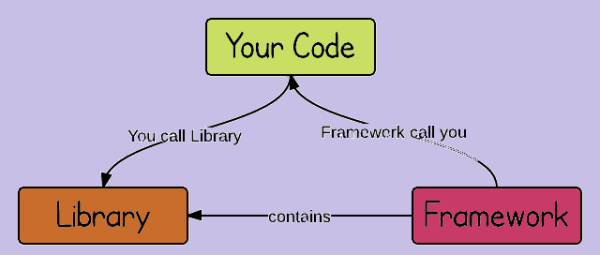

# Vue - 渐进式JavaScript框架


## 课程介绍

- 1 Vue 基础知识
- 2 Vue 全家桶（vue/vue-router/vuex + axios）
- 3 组件化开发
- 4 webpack - 前端模块化打包构建工具
- 5 Vue 项目

## 介绍

- [vue 中文网](https://cn.vuejs.org/)
- [vue github](https://github.com/vuejs/vue)
- Vue.js (读音 /vjuː/，类似于 view) 是一套构建用户界面(UI)的渐进式 JavaScript 框架
- 要求：**通读一遍 Vue 官网教程中的基础内容**

## 库和框架的区别



- 写在前面：JavaScript 从最开始的表单验证，到现在轻松实现复杂的大型应用`无所不能`，没有一个框架怎么行？
- [我们所说的前端框架与库的区别？](https://zhuanlan.zhihu.com/p/26078359?group_id=830801800406917120)

### Library

> 库，本质上是一些函数的集合。每次调用函数，实现一个特定的功能，接着把`控制权`交给使用者

- 代表：jQuery
- jQuery 这个库的核心：DOM 操作，即：封装 DOM 操作，简化 DOM 操作

### Framework

> 框架，是一套完整的解决方案，使用框架的时候，需要把你的代码放到框架合适的地方，框架会在合适的时机调用你的代码

- 框架规定了自己的编程方式，是一套完整的解决方案
- 使用框架的时候，由框架控制一切，我们只需要按照规则写代码

### 主要区别

- You call Library, Framework calls you
- 核心点：**控制反转**（谁起到主导作用）
  - 框架中控制整个流程的是框架
  - 使用库，由开发人员决定如何调用库中提供的方法（辅助）
- 好莱坞原则：Don't call us, we'll call you

---

## MVVM 的介绍

- MVVM，一种更好的 UI 模式解决方案
- [从 Script 到 Code Blocks、Code Behind 到 MVC、MVP、MVVM - 科普](http://www.cnblogs.com/indream/p/3602348.html)
- 

### MVC

- MVC 是一种软件架构模式，也有人叫做设计模式
- M: Model 数据模型（专门用来操作数据，数据的 CRUD）
- V：View 视图（对于前端来说，就是页面）
- C：Controller 控制器（是视图和数据模型沟通的桥梁，用于处理业务逻辑）

### MVVM

- MVVM ===> M / V / VM
- M：model 数据模型
- V：view 视图
- VM：ViewModel 视图模型

### 优势

- MVC 模式，将应用程序划分为三大部分，实现了职责分离
- 但是，在前端中经常要通过 JS 代码来进行一些逻辑操作，最终还要把这些逻辑操作的结果展示在页面中。也就是需要频繁的操作 DOM
- *MVVM 通过`数据双向绑定`让数据自动地双向同步*
  - V（修改视图） -> M
  - M（修改数据） -> V
- **数据驱动视图的思想，数据是核心**

### Vue 中的 MVVM

- 注意：**不推荐直接手动操作 DOM！！！**

> 虽然没有完全遵循 MVVM 模型，Vue 的设计无疑受到了它的启发。因此在文档中经常会使用 vm (ViewModel 的简称) 这个变量名表示 Vue 实例

### 学习 Vue 要转化思想

- `数据驱动视图`：不要在想着怎么操作 DOM，而是想着如何操作数据！！！

---

## 起步 - Hello Vue

- 安装：`npm i vue`
- 注意：开发期间使用未压缩版 vue.js！！！重说三

```html
<div id="app">{{ msg }}</div>

<!-- 引入 vue.js -->
<script src="vue.js"></script>

<!-- 使用 vue -->
<script>
  const vm = new Vue({
    // el：提供一个在页面上已存在的 DOM 元素作为Vue实例的挂载目标
    el: '#app',
    // Vue 实例的数据对象，用于给 View 提供数据
    data: {
      msg: 'Hello Vue'
    }
  })
</script>
```

### Vue 实例

- 注意 1：**先在 data 中声明数据，再使用数据**
- 注意 2：Vue 首字母大写

```js
const vm = new Vue({
  data: {
    msg: '大家好，...'
  }
})
```

### 数据绑定

- 解释：使用`{{}}`（Mustache）从`data`中获取数据，并展示在模板中
- 说明：数据对象的属性值发生了改变，插值处的内容都会更新
- 说明：`{{}}`中只能出现 JavaScript 表达式
- 注意：**Mustache 语法不能作用在 HTML 元素的属性上**

```html
<h1>Hello, {{ msg }}.</h1>
<p>{{ isOk ? 'yes': 'no' }}</p>
<p>{{ 1 + 2 }}</p>

<!-- ！！！错误示范！！！ -->
<h1 title="{{ err }}"></h1>
```

### v-model

- 作用：在表单元素上创建双向数据绑定
- 思考：如何在 JS 代码中获取到文本框的值？？？

```html
<input type="text" v-model="message" placeholder="edit me">
<p>Message is: {{ message }}</p>
```

---

## Vue two way data binding

- 双向数据绑定：将 DOM 与 Vue 实例的 data 数据绑定到一起，彼此之间相互影响
  - 数据的改变会引起 DOM 的改变
  - DOM 的改变也会引起数据的变化
- 原理：数据劫持，`Object.defineProperty`中的`get`和`set`方法
  - `getter`和`setter`：访问器
  - 作用：指定`读取或设置`对象属性值的时候，执行的操作
- 注意：`Object.defineProperty`方法是 ES5 中提供的，IE8 浏览器不支持这个方法。因此，Vue 支持 IE8 及其以下版本浏览器
- [Vue - 深入响应式原理](https://cn.vuejs.org/v2/guide/reactivity.html)
- [MDN - Object.defineProperty()](https://developer.mozilla.org/en-US/docs/Web/JavaScript/Reference/Global_Objects/Object/defineProperty)

```js
/*
  语法
*/

const obj = {}
Object.defineProperty(obj, 'msg', {
  // 设置 obj.msg 执行的操作
  set() {},
  // 读取 obj.msg 执行的操作
  get() {}
})
```

### Vue 双向绑定的极简实现

- [剖析 Vue 原理&实现双向绑定 MVVM](https://segmentfault.com/a/1190000006599500)

```html
<!-- 示例 -->
<input type="text" id="txt" />
<span id="msg"></span>

<script>
const text = document.getElementById('txt')
const msg = document.getElementById('msg')

const data = {}
let temp
Object.defineProperty(data, 'txt', {
  get() {
    return temp
  },
  set(val) {
    temp = val

    text.value = val
    msg.innerText = val
  }
})

// 只要文本框的值改变，这个事件就会触发
text.oninput = function () {
  data.txt = this.value
}
data.txt = '默认值'
console.log(data.txt)
</script>
```

## 指令

- 解释：指令 (Directives) 是带有 `v-` 前缀的特殊属性
- 作用：当表达式的值改变时，将其产生的连带影响，响应式地作用于 DOM

### v-text

- 解释：更新 DOM 对象的 textContent

```html
<h1 v-text="msg"></h1>
```

### v-html

- 解释：更新 DOM 对象的 innerHTML

```html
<h1 v-html="msg"></h1>
```

### v-bind

- 作用：当表达式的值改变时，将其产生的连带影响，响应式地作用于 DOM
- 语法：`v-bind:title="msg"`
- 简写：`:title="msg"`

```html
<!-- 完整语法 -->
<a v-bind:href="url"></a>

<!-- 缩写 -->
<a :href="url"></a>
```

## 样式处理 - class 和 style

- 使用方式：`v-bind:class="expression"` or `:class="expression"`
- 表达式的类型：对象（重点）、字符串、数组

```html
<!-- 1 -->
<!-- 重点 -->
<div v-bind:class="{ active: true }"></div> ===>
<div class="active"></div>

<!-- 2 -->
<div :class="['active', 'text-danger']"></div> ===>
<div class="active text-danger"></div>

<!-- 3 -->
<div v-bind:class="[{ active: true }, errorClass]"></div> ===>
<div class="active text-danger"></div>


--- style ---
<!-- 1 -->
<div v-bind:style="{ color: activeColor, 'font-size': fontSize + 'px' }"></div>
<!-- 2 将多个 样式对象 应用到一个元素上-->
<!-- baseStyles 和 overridingStyles 都是对象 -->
<!-- 如果有相同的样式，以后面的样式为准 -->
<div v-bind:style="[baseStyles, overridingStyles]"></div>
```

### v-on

- 作用：绑定事件
- 语法：`v-on:click="say"` or `v-on:click="say('参数', $event)"`
- 简写：`@click="say"`
- 说明：绑定的事件从`methods`中获取
- 事件中的this表示当前Vue实例

```html
<!-- 完整语法 -->
<a v-on:click="doSomething"></a>
<!-- 缩写 -->
<a @click="doSomething"></a>
```

### v-for

- 作用：基于源数据多次渲染元素或模板块

```html
<!-- 1 基础用法 -->
<div v-for="item in items">
  {{ item.text }}
</div>

<!-- item 为当前项，index 为索引 -->
<p v-for="(item, index) in list">{{item}} -- {{index}}</p>


<!-- 遍历obj对象， item 为值，key 为键，index 为索引 -->
<p v-for="(item, key, index) in obj">{{item}} -- {{key}}</p>
<p v-for="item in 10">{{item}}</p>
```

### key 属性

- 推荐：使用 `v-for` 的时候提供 `key` 属性
- `key` 的值，是唯一的，不重复的！！！
- 注意：渲染列表时不添加 `key` 属性，会导致一些错误，比如：临时DOM状态错位
- 说明：
  - 1 就地复用策略
  - 2 就地复用的问题
  - 3 最佳实践
- [vue key](https://cn.vuejs.org/v2/guide/list.html#key)
- [vue key 属性的说明](https://www.zhihu.com/question/61064119/answer/183717717)

```html
<div v-for="item in items" :key="item.id">
  <!-- 内容 -->
</div>
```

### v-if 和 v-show

- [条件渲染](https://cn.vuejs.org/v2/guide/conditional.html)
- `v-if`：根据表达式的值的真假条件，销毁或重建元素
- `v-show`：根据表达式之真假值，切换元素的 display CSS 属性

```html
<p v-show="isShow">这个元素展示出来了吗？？？</p>
<p v-if="isShow">这个元素，在HTML结构中吗？？？</p>
```

### 提升性能：v-pre

- 说明：跳过这个元素和它的子元素的编译过程。可以用来显示原始 Mustache 标签。跳过大量没有指令的节点会加快编译。

```html
<span v-pre>{{ this will not be compiled }}</span>
```

### 提升性能：v-once

- 说明：只渲染元素和组件一次。随后的重新渲染，元素/组件及其所有的子节点将被视为静态内容并跳过。这可以用于优化更新性能。

```html
<span v-once>This will never change: {{msg}}</span>
```

---

### 事件修饰符

- **`.prevent` 阻止默认行为，调用 event.preventDefault()**
- `.stop` 阻止冒泡，调用 event.stopPropagation()
- `.capture` 添加事件侦听器时使用事件`捕获`模式
- `.self` 只当事件在该元素本身触发时，才会触发事件
- `.once` 事件只触发一次

## 异步 DOM 更新

- 说明：Vue 异步执行 DOM 更新，监视所有数据改变，一次性更新 DOM
- 优势：可以去除重复数据，对于避免不必要的计算和避免重复 DOM 操作上，非常重要
- `Vue.nextTick(callback)`：在 DOM 更新后，执行某个操作（DOM 操作）
  - `vm.$nextTick(function () {})`
  - `$el`：表示 Vue 管理区域的根元素，是一个 DOM 对象

```js
methods: {
  fn () {
    this.msg = 'change'
    this.$nextTick(function () {
      console.log('$nextTick中打印：', this.$el.children[0].innerText)
    })
    console.log('直接打印：', this.$el.children[0].innerText)
  }
}
```

## 动态添加数据的注意点

- 注意：只有`data`中的数据才是响应式的，动态添加进来的数据默认为非响应式
- 可以通过以下方式实现动态添加数据的响应式
  - 1 `Vue.set(object, key, value)` - 适用于添加单个属性
  - 2 `Object.assign()` - 适用于添加多个属性

```js
const vm = new Vue({
  data: {
    stu: {
      name: 'jack',
      age: 19
    }
  }
})

/* Vue.set */
Vue.set(vm.stu, 'gender', 'male')
vm.$set()

/* Object.assign */
vm.stu = Object.assign({}, vm.stu, { gender: 'female', height: 180 })
```

